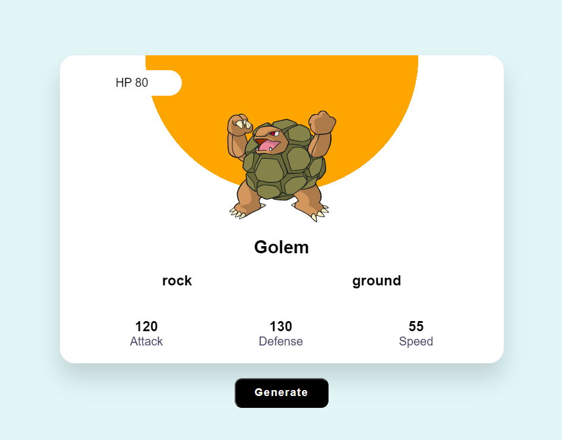

# PokemonGenarator

#### PokemonGenarator 150 pokemon arasında rastgele seçilen Pokemonların özelliklerini getiren bir App'dir. Pokemon bilgilerinin bulunduğu card'ın altındaki "Generate" buttonuna her tıklandığında rastgele yeni bir pokemon gelir ve onun bilgilerini basar. 
 

## Metotlar ve Teknolojiler
#### PokemonGenarator gerekli pokemon bilgisini "pokeapi.co/api" api'sinden çeker. Her bir generate'de rastgele bir sayı üretilir ve bu sayı değeri, pokeapi'deki ıd si eşit olan pokemonu generate eder. Gelen Pokemon'nun type'ına göre card'ın üstünde bulunan yarım dairenin rengi değişir.
 

